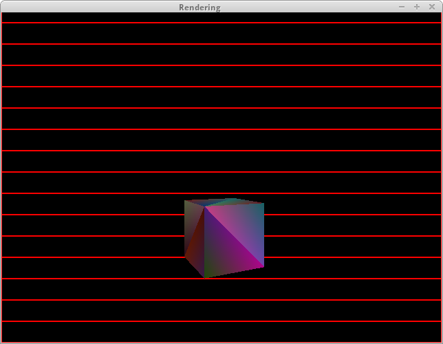

Rendering
===

This is a multithreaded software OpenGL-like renderer.

Primitives (such as lines and triangles) are rasterized using vertex and pixel shaders. This is done by multiple worker threads (using POSIX Threads), each rendering some portion of the image (highlighted using the red rectangles below). A simple custom linear algebra library is used for calculations, and the resulting image is displayed using GLFW and real OpenGL.

The demonstration program is in the [`main.c`](main.c) file, and the reset of header and source files are components of the library.

## Screenshot

## Builds

Prebuilt executables for Linux and Windows are available [here](https://github.com/afdw/files/tree/master/Builds/Rendering).

## License

This project is licensed under either of

 * Apache License, Version 2.0, ([LICENSE-APACHE](LICENSE-APACHE) or
   http://www.apache.org/licenses/LICENSE-2.0)
 * MIT license ([LICENSE-MIT](LICENSE-MIT) or
   http://opensource.org/licenses/MIT)

at your option.
